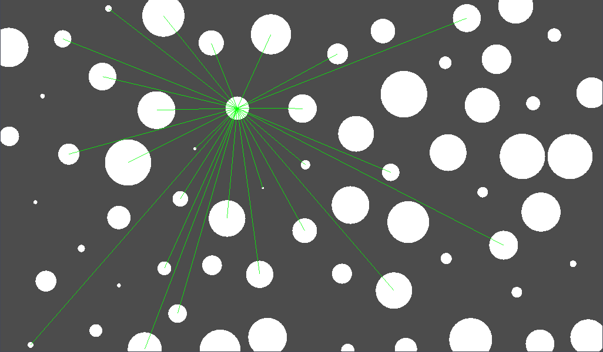
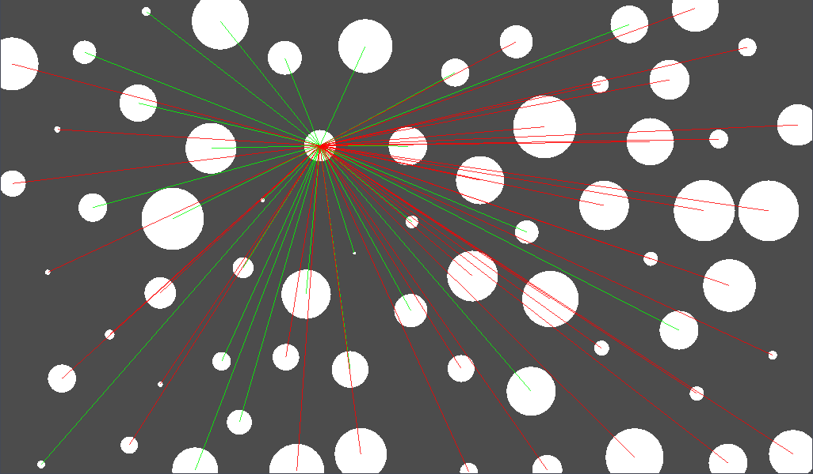
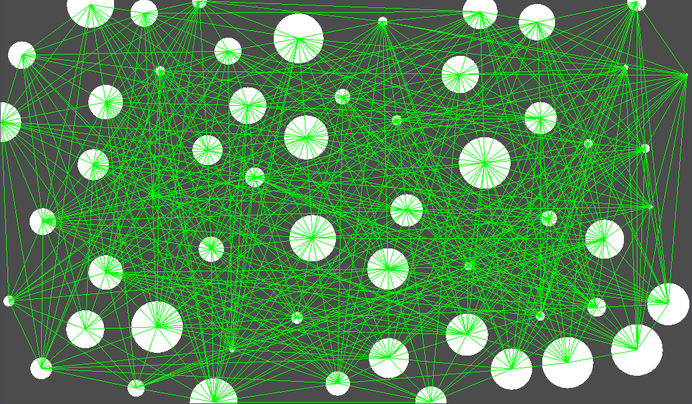

# An Obstruction Algorithm

An interesting problem that I encoutered during development, documenting it for reference.

## Problem Statement

In a two-dimensional space, given $n$ non-overlapping circles, for any two circles, the line connecting their centers is defined as the path between them. If this path intersects or tangentially touches other circles, it is considered obstructed. The task is to determine all unobstructed paths between circles in this two-dimensional space.

## Algorithm

* **Naive Approach**: Brute force traverse each edge, complexity of $(O(n^3)$).
* **Optimized Solution**: For each circle, sort the other circles based on their distance to the circle (closest distance from center to a point on the circle), then traverse starting from the closest circles, calculating obstruction slopes for every other circle. Store these in a interval tree, and for each query, check if that angle is obstructed in the tree. The expected complexity in ideal conditions is $(O(n^2 log n))$.

Inspired by **@NijikaIjichi** https://github.com/NijikaIjichi

Graphics by Godot Engine

## Some Illustration (For better understanding)
**unobstructed paths are shown in green, obstructed paths are shown in red**

**unobstructed paths of the whole space**

